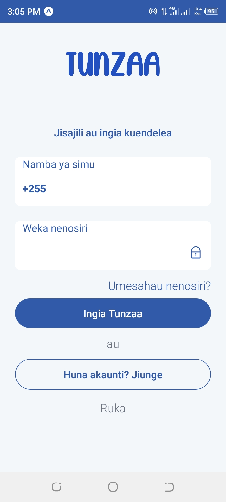
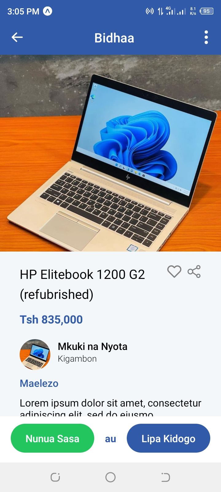

# Preview

Tunzaa clone build in React Native + TailwindCSS using firebase REST API

#Tech
React Native
Tailwind CSS
Firebase

#Development
Here are these steps to run the project locally

1. Clone the repository
   git clone https://github.com/isayaexavery/tunzaa-clone.git

2. Install dependancies
   npm install

3. Create firebase project and select the web app.
   Make sure you have enabled the following firebse services

- Authentication. Enable Email sign-in method.

4. Add your Firebase Config.
   Create .env file then add your API_KEY to .env file

5. Finally , `npx expo start`

# ScreenShots

HOME SCREEN

SIGNIN SCREEN

PRODUCT SCREEN

SETTINGS SCREEN

